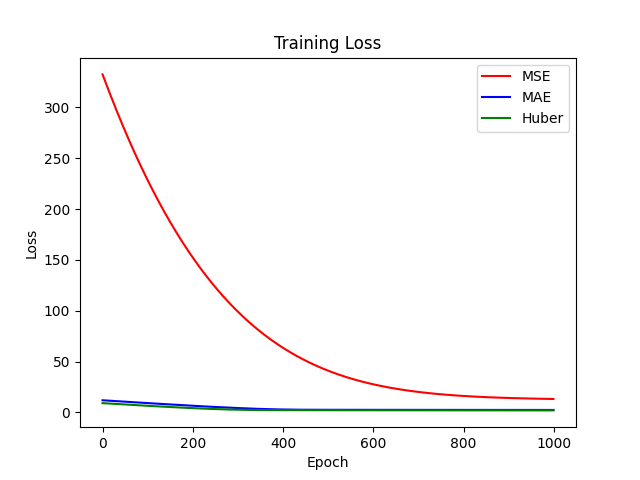
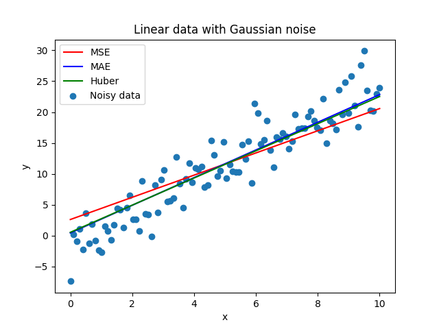

# Comparison of MSE, MAE, and Huber Loss for Linear Regression

## Introduction

Loss functions play a critical role in training machine learning models, directly influencing convergence, robustness to outliers, and overall predictive performance. This project explores and compares three widely used regression loss functions—Mean Squared Error (MSE), Mean Absolute Error (MAE), and Huber Loss—to understand their behavior in practice.

This project aims to gain a deeper understanding of how different loss functions affect model training, and to showcase practical experimental and analytical skills for ML

### Objective:
To empirically evaluate and compare the performance of MSE, MAE, and Huber loss in regression tasks, examining their convergence patterns and sensitivity to outliers.

## Dataset

A synthetic dataset was generated for this project to clearly observe the effects of each loss function:

Number of points: 100

Data characteristics: Linear relationship with added normally distribiuted noise 

Purpose: Controlled environment for visualizing regression fits and loss convergence

## Methodology

Model: Simple linear regression (implemented with PyTorch)

Loss functions tested:

MSE Loss

MAE Loss

Huber Loss 

Training setup:

Optimizer: Adam

Learning rate: 0.01

Epochs: 500

Evaluation:

Plotted loss curves over epochs to visualize convergence

Plotted regression lines to observe fit to the data points

## Results

### Loss Curves

Observations:

MSE: Converges much more slowly and doesnt coverge past a certain point

MAE: More robust to outliers but converges slowly.

Huber: Combines the advantages of MSE and MAE, converging slightly faster then MAE .

### Regression Lines

Observations:

MSE line: Closely fits the majority of points but is skewed by outliers.

MAE line:  less sensitive to outliers, resulting in a more balanced fit.

Huber line: slightly improves on MAE .

## Discussion

Sensitivity to outliers: MSE exaggerates the influence of extreme points, while MAE and Huber provide more robust alternatives.

Convergence behavior: MSE often converges faster but may oscillate near outliers. Huber Loss offers a good trade-off between convergence speed and robustness.

Practical implications:

Use MSE when outliers are rare or not impactful.

Use MAE for datasets with frequent outliers.

Huber is ideal when moderate robustness and smooth gradients are desired.

These findings are directly applicable to regression problems in computer vision, such as depth estimation or pixel-level predictions, where outliers are common.

Conclusion

This project demonstrates the practical differences between MSE, MAE, and Huber loss, emphasizing how the choice of loss function affects both model convergence and robustness to outliers. By implementing the experiments and analyzing the results, I have strengthened my ability to reason about model behavior—a skill directly relevant for computer vision research.

